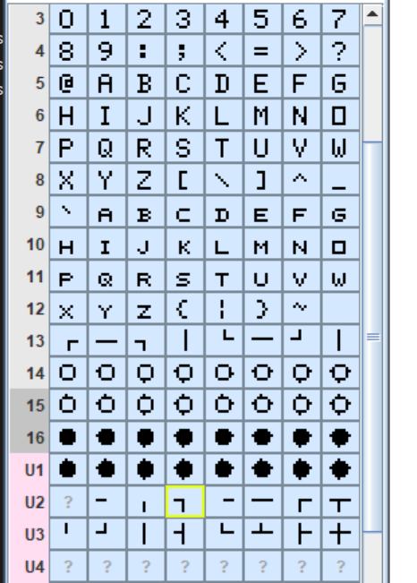

this is a MSX game written in [H-Forth](https://github.com/MIN0/H-FORTH_MSX)  The source file masyu.4th generates masyu.com file which can be packages into a DSK file and run in emulators.  This program is designed to run on MSX1 as well as any later MSX.

The program was written to submit to MSXDEV25

### How to compile and run the game
In order to compile the source you'll need to setup a MSX-DOS disk and copy HFORTH.COM from H-FORTH site.  Then `HFORTH masyu.4th` will compile and produce a masyu.com file.  Running the game is just running MASYU.com from the MSX-DOS prompt, or if you have a .DSK file then boot with that disk.

### About the program
The fonts allow for the display of lines and circles.  I used a tool called Magellan to generate the fonts.  masyu.mag file is the map file for magellan.  It is not needed for building, but included for completeness.  
	

### How to play the game
Move around the board with arrow keys or joystick.  Hold shif to connect cells, hold ctl to disconnect while moving.  The objective of [Masyu](https://en.wikipedia.org/wiki/Masyu) is to find a loop that traverses all circles while satisfying the following.
- only one loop with no crosses
- lines must pass through while circles and turn in the next circle.
- lines must turn inside black circles and continue straight through the next square.  In other words two lines of at least two units long meet at 90 degrees inside a black circle.

